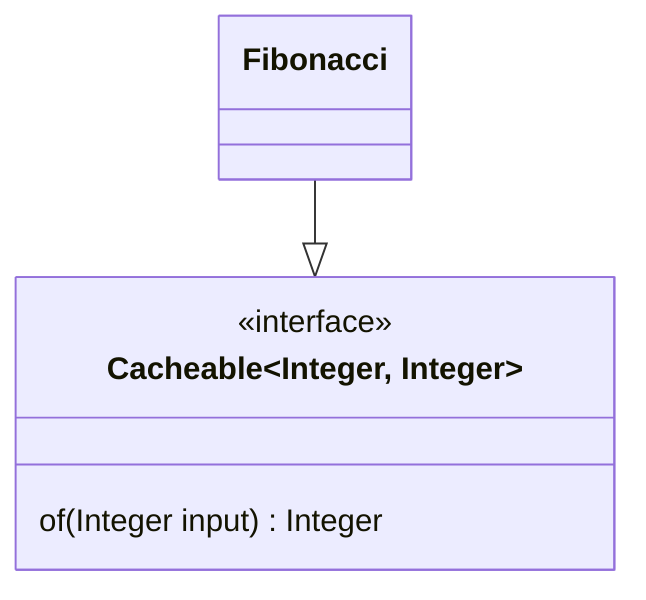

# Memoization using Proxy API

### What's memoization

Wikipedia:
> Memoization or memoisation is an optimization technique used primarily to speed up computer programs by storing the 
> results of expensive function calls and returning the cached result when the same inputs occur again. 
> Memoization has also been used in other contexts (and for purposes other than speed gains), 
> such as in simple mutually recursive descent parsing.[1] 
> Although related to caching, memoization refers to a specific case of this optimization, 
> distinguishing it from forms of caching such as buffering or page replacement. 
> In the context of some logic programming languages, memoization is also known as tabling.
> [See more...](https://en.wikipedia.org/wiki/Memoization)

### Proxy API:
Simply wraps and intercepts a function so we can add extra functionality to it, in our case, 
to memoize inputs and outputs for the fibonacci function.

## How to use:
Wrap a `Cacheable` instance in the `Cache.withCache` function.

#### Eg.:

**Given that:**


**Then:**
```java
    Cacheable<Integer, Integer> fibonacci = Cache.withCache(new Fibonacci());
```

## Limitations:
- Cacheable just accepts one input and one output. Multiple args can be wrapped into a collection.
- Recursive calls cannot be memoized, since within the method scope, the proxy cannot be reached, therefore the actual method is called.


## TODO's:
- Attenuate the limitations, specially regarding recursive calls.
